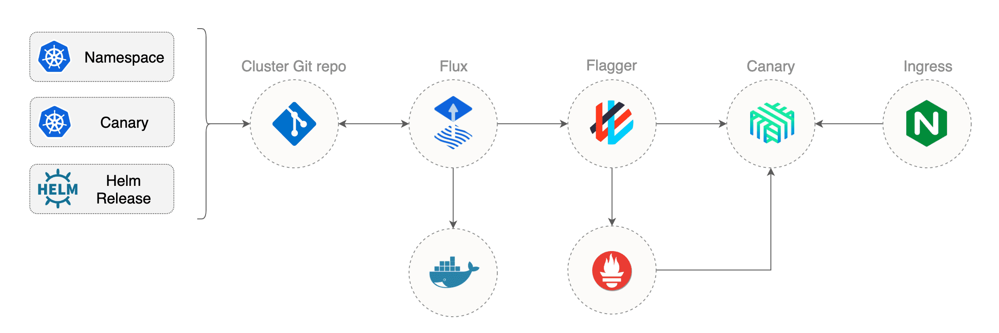

# Gitops


# Clone
```sh
export GHUSER=iac-projects
git clone https://github.com/${GHUSER}/gitops-helm-workshop
```

## Cluster state directory structure:
```sh
├── cluster
    ├── canaries
    ├── charts
    │   └── podinfo
    ├── namespaces
    └── releases
```


```sh
# As Devops Enginer, use cli app/tool (from remote)
# To config remote k8s cloud
# Then agent on k8s will watch change of repo...

# 1. Add Flux repository to Helm repos
# 2. Create the fluxcd namespace
# 3. Install Flux by providing your GitHub repository URL
# 4. Install helm operator
# 5. Install linkerd
# 6. Install flagger
# 6. Config flagger with linkerd


make deploy


```

## Install NGINX
- To expose applications outside of the cluster you'll be using the NGINX ingress controller. The controller will run inside the Linkerd mesh.
```sh
git add -A && \
git commit -m "install ingress" && \
git push origin master && \
fluxctl sync
```